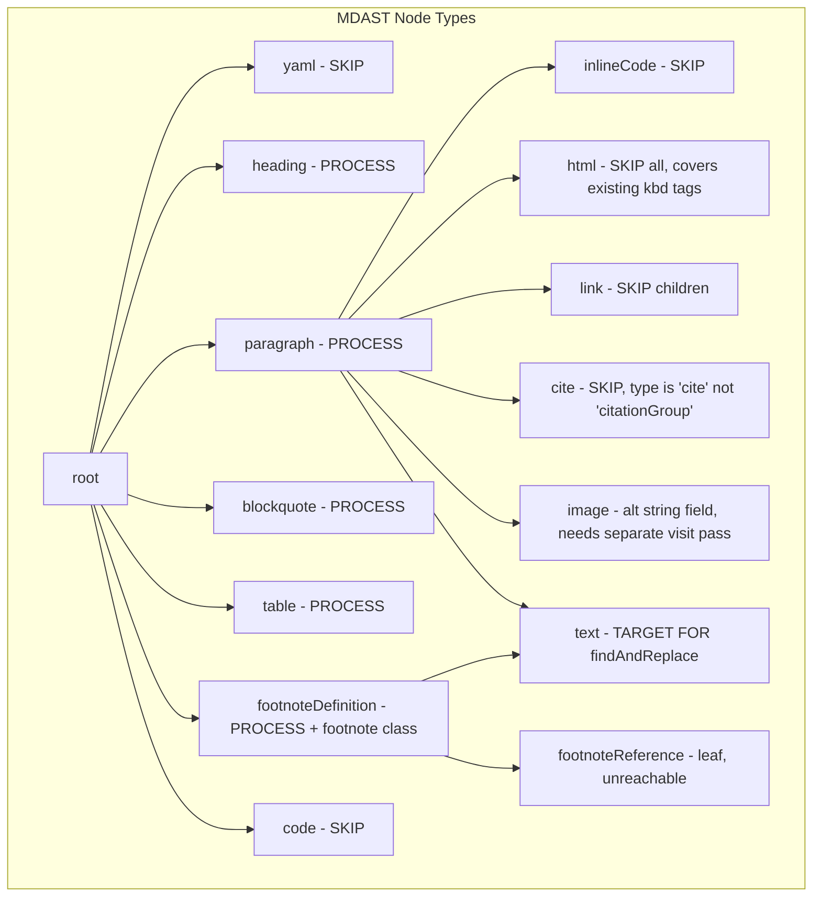

# feat: Turborepo Monorepo with Markdown Annotator Library and React Web App

## Enhancement Summary

**Deepened on:** 2026-03-22
**Research agents used:** TypeScript reviewer, Performance oracle, Architecture strategist, Frontend races reviewer, Security sentinel, Code simplicity reviewer, Pattern recognition specialist, Framework docs researcher (remark/unified), Turborepo/tsup best practices researcher, Shadcn/Tailwind best practices researcher

### Key Improvements
1. **Critical bug fixed**: Plan used `citationGroup` as the remark-cite AST node type — the actual type is `"cite"`. Using the wrong type in the `ignore` list would silently fail to skip citations.
2. **Image alt text**: `image.alt` is a plain string field (not child `text` nodes), so `findAndReplace` cannot process it. A separate `visit(tree, 'image', ...)` pass is required to annotate image alt text.
3. **Footnote context**: Use `match.stack` from `mdast-util-find-and-replace`'s replace callback — no separate `visitParents` call needed. The stack is provided for free.
4. **Single `html` node**: Return the full `<kbd>...</kbd>` as one `html` node (not open+text+close), eliminating the need for `_protected` type workarounds on re-passes.
5. **`annotateMarkdownBatch` API**: Added alongside the single-entry API for performance — one pipeline pass for all entries instead of three.

### New Considerations Discovered
- A working reference implementation exists at `/Users/dave/Developer/index-helper/` using the identical pipeline
- `AnnotateInfo.name` should be renamed to `AnnotateInfo.entryText` to match the HTML attribute name
- `isFootnote` should be removed from `AnnotateInfo` entirely — it's dead API surface
- HTML attributes need `escapeHtmlAttr()` to prevent injection when library is used externally
- `test` task in turbo.json should remove `dependsOn: ["build"]` — Vitest runs against TypeScript source directly
- `"moduleResolution": "Bundler"` (not `"NodeNext"`) avoids `.js` extension requirement
- Output `useState` should be managed outside react-hook-form
- A `setTimeout(0)` yield is needed before synchronous processing to allow React to paint the loading state

---

## Overview

Build a Turborepo monorepo from scratch containing two workspaces:

1. **`packages/markdown-annotator`** — A TypeScript ESM library that uses the remark/unified AST pipeline to find terms in markdown and wrap them in `<kbd>` tags as index annotations.
2. **`apps/web`** — A React Vite single-page application (Shadcn, Tailwind, Zod) that uses the library to annotate a user-provided markdown document with three hardcoded term groups.

### Research Insights

**Working reference:** `/Users/dave/Developer/index-helper/` is an existing implementation of the identical pipeline using `<damn>` tags. Study these files before implementing:
- `lib/remarkWrapWords.js` — plugin implementation
- `lib/buildProcessor.js` — pipeline assembly
- `lib/buildPattern.js` — regex builder with Unicode-aware boundaries
- `test/markup.test.js` — behavioral test suite

---

## Problem Statement / Motivation

The project is a tool for annotating academic markdown documents with index entries. The library needs to be reusable by any downstream application. The web app provides a simple interface to demonstrate and use the annotation capability without requiring a CLI or build step.

---

## Proposed Monorepo Structure

```
index-helper2/
├── package.json              # root — pnpm workspaces, "packageManager": "pnpm@9"
├── pnpm-workspace.yaml       # declares packages/* and apps/*
├── turbo.json                # v2 pipeline using "tasks" (not "pipeline")
├── tsconfig.base.json        # shared strict TS options
├── .gitignore
│
├── packages/
│   └── markdown-annotator/
│       ├── package.json      # name: @index-helper2/markdown-annotator, "type": "module"
│       ├── tsconfig.json     # extends ../../tsconfig.base.json, "moduleResolution": "Bundler"
│       ├── tsup.config.ts
│       ├── vitest.config.ts
│       └── src/
│           ├── index.ts           # public API re-export
│           ├── annotate.ts        # annotateMarkdown + annotateMarkdownBatch functions
│           ├── annotate.test.ts   # vitest tests (co-located)
│           ├── types.ts           # AnnotateInfo interface (no isFootnote, name→entryText)
│           └── utils/
│               └── regex-builder.ts  # buildRegex(term): RegExp with \p{L} + u flag
│
└── apps/
    └── web/
        ├── package.json          # name: @index-helper2/web
        ├── tsconfig.json
        ├── tsconfig.app.json     # baseUrl + paths for @/ alias
        ├── tsconfig.node.json
        ├── vite.config.ts        # resolve.alias @/ + vite-tsconfig-paths
        ├── tailwind.config.ts    # Tailwind v3
        ├── postcss.config.js
        ├── components.json       # Shadcn config, "rsc": false
        ├── index.html
        └── src/
            ├── main.tsx
            ├── App.tsx
            ├── constants/
            │   └── annotate-config.ts   # INDEX_ENTRIES const (note transfuxion spelling)
            ├── lib/
            │   └── process-markdown.ts  # calls annotateMarkdownBatch
            └── components/
                ├── MarkdownForm.tsx      # react-hook-form + Zod, output in useState
                ├── InputArea.tsx         # Shadcn Textarea for user input
                └── OutputArea.tsx        # read-only Shadcn Textarea (readOnly not disabled)
```

### Research Insights

**Simplified library structure:** The original plan included `plugins/skip-nodes.ts` and `utils/class-builder.ts` as separate files. Both are YAGNI — skip logic and class-building are 3-line inline operations with exactly one call site each. The `plugins/` directory is eliminated. Only `utils/regex-builder.ts` earns its own file (non-trivial, independently testable).

---

## Technical Approach

### Architecture Decision: `isFootnote` Removed from `AnnotateInfo`

The `AnnotateInfo.isFootnote` field is dead API surface — the library always performs context-based footnote detection via `match.stack` from `mdast-util-find-and-replace`. Publishing a field that does nothing misleads consumers. **Remove `isFootnote` from the interface entirely for v1.**

### Architecture Decision: Rename `name` → `entryText` on `AnnotateInfo`

The `name` field maps directly to the `entryText` HTML attribute. The `parent` field maps to `entryParent`. Using `name` vs `entryText` as different words for the same concept forces readers to mentally translate. Renaming to `entryText` makes the mapping transparent and consistent.

```ts
export interface AnnotateInfo {
  readonly entryText: string;       // → <kbd entryText="..." title="...">
  readonly entryParent?: string;    // → <kbd entryParent="...">
  readonly terms: [string, ...string[]]; // at least one term required
  readonly isImportant: boolean;
}
```

### Architecture Decision: Single `AnnotateInfo` Per Call + Batch Variant

The single-entry function is kept for API simplicity. A batch variant is added for performance — one pipeline pass for all entries:

```ts
// Single entry (original)
export function annotateMarkdown(markdown: string, entry: AnnotateInfo): Result<string>

// Batch — one pipeline pass, preferred for multi-entry use
export function annotateMarkdownBatch(markdown: string, entries: AnnotateInfo[]): Result<string>
```

The web app uses `annotateMarkdownBatch`. The single-entry function delegates to the batch variant with a single-element array.

### Architecture Decision: `Result<string>` Return Type

remark plugins can throw. Callers should not need to remember to wrap in try/catch.

```ts
export type Result<T, E = Error> =
  | { readonly ok: true; readonly value: T }
  | { readonly ok: false; readonly error: E }
```

### Architecture Decision: Output is Raw Annotated Markdown Text

The output textarea shows the raw annotated markdown string (with `<kbd>` tags as plain text), not rendered HTML. The user copies the annotated source for downstream tools (e.g., Pandoc). **No XSS risk** — a `<textarea value={...}>` renders its content as plain text, never as HTML.

### Package Manager: pnpm + Turborepo v2

```json
// pnpm-workspace.yaml
packages:
  - "packages/*"
  - "apps/*"
```

Root `package.json` should include `"packageManager": "pnpm@9.0.0"` for deterministic version pinning.

### Library Build: tsup (ESM-only)

```ts
// packages/markdown-annotator/tsup.config.ts
import { defineConfig } from 'tsup'

export default defineConfig({
  entry: ['src/index.ts'],
  format: ['esm'],     // ESM-only; no CJS needed for Vite consumers
  dts: true,           // generates dist/index.d.ts
  sourcemap: true,
  clean: true,
  treeshake: true,
  splitting: false,    // no chunk splitting for a library
})
```

`package.json` exports — `"types"` condition must come before `"import"` (TypeScript resolves in order):

```json
{
  "name": "@index-helper2/markdown-annotator",
  "version": "0.1.0",
  "type": "module",
  "exports": {
    ".": {
      "types": "./dist/index.d.ts",
      "import": "./dist/index.js",
      "default": "./dist/index.js"
    }
  },
  "main": "./dist/index.js",
  "types": "./dist/index.d.ts",
  "files": ["dist"]
}
```

### remark Pipeline

```
remark-parse
  → remark-frontmatter    (creates yaml node — never has text children)
  → remark-gfm            (enables tables, footnoteDefinition, footnoteReference nodes)
  → @benrbray/remark-cite (creates "cite" nodes — NOT "citationGroup")
  → findAndReplace with ignore list + replace callback
remark-stringify          (emits html nodes verbatim — no escaping)
```

**Pre-build the processor once, freeze it:**

```ts
import { unified } from 'unified'
import remarkParse from 'remark-parse'
import remarkFrontmatter from 'remark-frontmatter'
import remarkGfm from 'remark-gfm'
import remarkCite from '@benrbray/remark-cite'
import remarkStringify from 'remark-stringify'

const baseProcessor = unified()
  .use(remarkParse)
  .use(remarkFrontmatter)
  .use(remarkGfm)
  .use(remarkCite)
  .use(remarkStringify)
  .freeze() // freeze() prevents further .use() calls, enables safe reuse
```

Call `.parse()` and `.stringify()` on the frozen processor, apply `findAndReplace` imperatively between them.

### remark AST Node Types — Corrected Skip List

**CRITICAL FIX:** The plan originally used `'citationGroup'` — this is wrong. The actual type string emitted by `@benrbray/remark-cite` is `"cite"`. Using the wrong type in `ignore` would silently fail to skip citations.

```ts
import { findAndReplace } from 'mdast-util-find-and-replace'

findAndReplace(tree, patterns, {
  ignore: [
    'yaml',               // frontmatter — no text children anyway
    'code',               // fenced code blocks
    'inlineCode',         // backtick code
    'html',               // raw HTML nodes — covers ALL existing <kbd> variants
    'cite',               // @benrbray/remark-cite nodes (NOT "citationGroup")
    'link',               // URL text in [text](url) — text children skipped
    'linkReference',      // [text][ref] — text children skipped
    'footnoteReference',  // [^name] inline refs — leaf node, no children
  ]
})
```

`image` nodes are **not** in this ignore list — but `findAndReplace` cannot reach image alt text anyway (see below).

### Image Alt Text: Separate Visit Pass Required

**CRITICAL:** `image` nodes store alt text in `node.alt: string` — a plain string field, not child `text` nodes. `findAndReplace` only operates on `text` type nodes, so image alt text is **unreachable** by `findAndReplace` regardless.

To annotate image alt text, a separate `visit(tree, 'image', ...)` pass is needed before or after `findAndReplace`:

```ts
import { visit } from 'unist-util-visit'
import type { Image } from 'mdast'

visit(tree, 'image', (node: Image) => {
  if (!node.alt) return
  // Apply term matching to node.alt string
  // Replace with annotated version
  // Note: node.alt is plain text — the <kbd> tags become part of the alt string
  node.alt = applyTerms(node.alt, entries)
})
```

This is a separate implementation step not present in the original plan.

### Footnote Body Detection: Use `match.stack`

`mdast-util-find-and-replace@3` provides `match.stack` in every replace callback — no separate `visitParents` call needed:

```ts
import type { RegExpMatchObject } from 'mdast-util-find-and-replace'

const replaceFunction = (matched: string, match: RegExpMatchObject) => {
  const isInFootnote = match.stack.some(n => n.type === 'footnoteDefinition')
  // ...build and return html node
}
```

### HTML Node Construction (Single Node Pattern)

Return a **single `html` node** for the full `<kbd>...</kbd>`. Do NOT split into three nodes (open tag, text, close tag) — the inner text node would be vulnerable to re-annotation and requires workarounds.

```ts
import { escapeHtmlAttr } from './utils/escape-html-attr'

const buildKbdNode = (matched: string, entry: AnnotateInfo, inFootnote: boolean): Html => {
  const classes = ['indexEntrytct']
  if (inFootnote) classes.push('footnote')
  if (entry.isImportant) classes.push('important')

  const title = `En el índice analítico como '${escapeHtmlAttr(entry.entryText)}'`
  const entryParentAttr = entry.entryParent
    ? ` entryParent="${escapeHtmlAttr(entry.entryParent)}"`
    : ''

  return {
    type: 'html',
    value: `<kbd title="${title}" class="${classes.join(' ')}" entryText="${escapeHtmlAttr(entry.entryText)}"${entryParentAttr}>${matched}</kbd>`
  }
}
```

On re-parse, `<kbd class="indexEntrytct">` becomes a single `html` node — never visited by `findAndReplace` because `'html'` is in the ignore list. **Multi-pass idempotency is automatic.**

### Security: `escapeHtmlAttr` Utility

The library's `name`/`parent` values land in HTML attributes. When used externally with consumer-provided values, unescaped values enable HTML injection in downstream Pandoc-rendered output.

```ts
// src/utils/escape-html-attr.ts
export function escapeHtmlAttr(value: string): string {
  return value
    .replace(/&/g, '&amp;')
    .replace(/"/g, '&quot;')
    .replace(/'/g, '&#x27;')
    .replace(/</g, '&lt;')
    .replace(/>/g, '&gt;')
}
```

Apply to `entry.entryText` and `entry.entryParent` at every point of interpolation into the HTML string.

### Regex Strategy for Term Matching

```ts
// src/utils/regex-builder.ts
const regexCache = new Map<string, RegExp>()

export function buildRegex(term: string): RegExp {
  if (regexCache.has(term)) return regexCache.get(term)!

  const escaped = term.replace(/[.*+?^${}()|[\]\\]/g, '\\$&')
  // \p{L} with u flag: all Unicode letters, including all Spanish accented chars
  // Correct for: á é í ó ú ü ñ and all extended Latin — unlike the buggy À-ÿ range
  const pattern = new RegExp(`(?<!\\p{L})${escaped}(?!\\p{L})`, 'giu')
  regexCache.set(term, pattern)
  return pattern
}
```

**Why not `[a-zA-ZÀ-ÿ]`:** The range `À–ÿ` (U+00C0–U+00FF) includes `×` (U+00D7, multiplication sign) and `÷` (U+00F7, division sign) as "word characters", producing incorrect boundary behaviour. `\p{L}` is Unicode-correct and handles all Spanish accented characters, extended Latin, and everything else. Requires the `u` flag.

### TypeScript Plugin Typing

```ts
import type { Plugin } from 'unified'
import type { Root } from 'mdast'

export interface AnnotatePluginOptions {
  entries: AnnotateInfo[]
}

const remarkAnnotate: Plugin<[AnnotatePluginOptions], Root> = function (options) {
  return function (tree: Root): undefined {
    // findAndReplace + image visit pass
  }
}
```

### `Table: ` Prefix Handling

remark parses `Table: caption text` as a plain `paragraph` node. `findAndReplace` will match terms in `"Table: caption text"` starting from character 0. Since `"Table: "` starts with an uppercase `T` that is not one of the search terms, the prefix is preserved automatically for typical cases. Only if a term _is_ the word `"Table"` would a problem arise — handle by checking paragraph text nodes that start with `"Table: "` and applying matching only to the substring after the prefix.

### Web App Zod Validation + Form Pattern

```ts
// Zod schema
const MarkdownFormSchema = z.object({
  markdown: z.string().min(1, 'Please enter some markdown text'),
})
type FormValues = z.infer<typeof MarkdownFormSchema>
```

**Output state lives in `useState`, not react-hook-form:**

```tsx
const [output, setOutput] = useState('')
const [processingError, setProcessingError] = useState<string | null>(null)

const onSubmit = async (data: FormValues) => {
  setProcessingError(null)
  // Yield to browser's rendering pipeline BEFORE blocking the thread
  // Without this, React 18 batches the isSubmitting state update with the result
  // and the user never sees the loading state
  await new Promise<void>(resolve => setTimeout(resolve, 0))
  try {
    const result = processMarkdown(data.markdown)
    if (result.ok) {
      setOutput(result.value)
    } else {
      setProcessingError(result.error.message)
    }
  } catch (err) {
    setProcessingError(err instanceof Error ? err.message : 'Processing failed')
  }
}
```

**Use `readOnly` (not `disabled`) on output textarea:**
- `disabled` = greyed out, not keyboard-focusable, excluded from browser copy
- `readOnly` = visually active, fully selectable, correct for a copy-paste output

### Vite Workspace Library Resolution

```ts
// apps/web/vite.config.ts
import path from 'path'
import { defineConfig } from 'vite'
import react from '@vitejs/plugin-react'
import tsconfigPaths from 'vite-tsconfig-paths'

export default defineConfig({
  plugins: [react(), tsconfigPaths()],
  resolve: {
    alias: {
      '@': path.resolve(__dirname, './src'),
    },
  },
})
```

`vite-tsconfig-paths` reads `compilerOptions.paths` from `tsconfig.app.json` and applies them as Vite aliases — no duplication between tsconfig and vite.config. Install: `npm install -D vite-tsconfig-paths @types/node`.

---

## Implementation Phases

### Phase 1: Monorepo Scaffold

**Tasks:**
- Initialize root `package.json` with `"private": true`, `"type": "module"`, `"packageManager": "pnpm@9.0.0"`
- Create `pnpm-workspace.yaml`
- Create `turbo.json` (Turborepo v2 — use `"tasks"` not `"pipeline"`)
- Create `tsconfig.base.json` with shared strict TS options
- Add root `.gitignore`

**turbo.json (v2):**
```json
{
  "$schema": "https://turbo.build/schema.json",
  "ui": "tui",
  "tasks": {
    "build": {
      "dependsOn": ["^build"],
      "outputs": ["dist/**"],
      "inputs": ["src/**", "tsconfig.json", "tsup.config.ts", "package.json"]
    },
    "test": {
      "outputs": ["coverage/**"],
      "inputs": ["src/**", "vitest.config.ts"]
    },
    "dev": {
      "dependsOn": ["^build"],
      "persistent": true,
      "cache": false
    }
  }
}
```

**Note:** `test` has no `dependsOn: ["build"]` — Vitest runs directly against TypeScript source via esbuild. This keeps the feedback loop fast and avoids rebuilding on every test run.

**tsconfig.base.json:**
```json
{
  "compilerOptions": {
    "strict": true,
    "target": "ES2022",
    "module": "ESNext",
    "lib": ["ES2022"],
    "skipLibCheck": true,
    "noUncheckedIndexedAccess": true
  }
}
```

**`.gitignore` additions:**
```
.turbo
**/dist
**/coverage
```

**Success criteria:**
- `pnpm install` at root succeeds
- `turbo build` runs (even with empty workspaces)

### Phase 2: TypeScript Library Package

**Tasks:**
- Scaffold `packages/markdown-annotator/package.json` with `"type": "module"`, tsup build, vitest test
- Install dependencies: `unified`, `remark-parse`, `remark-stringify`, `remark-frontmatter`, `remark-gfm`, `@benrbray/remark-cite`, `unist-util-visit`, `mdast-util-find-and-replace`, `tsup`
- Create `tsconfig.json` extending base with `"moduleResolution": "Bundler"` (not `"NodeNext"`)
- Define `types.ts` with `AnnotateInfo` interface (no `isFootnote`, `entryText` not `name`)
- Implement `utils/regex-builder.ts` with `\p{L}` + `u` flag + module-level cache
- Implement `utils/escape-html-attr.ts`
- Implement `annotate.ts`:
  - Pre-build + freeze the unified processor at module scope
  - `annotateMarkdown(markdown, entry)` delegates to batch variant
  - `annotateMarkdownBatch(markdown, entries)`: single pipeline pass via `findAndReplace` + separate image alt visit
  - Returns `Result<string>`
- Export from `index.ts`

**`packages/markdown-annotator/tsconfig.json`:**
```json
{
  "extends": "../../tsconfig.base.json",
  "compilerOptions": {
    "moduleResolution": "Bundler",
    "outDir": "dist",
    "rootDir": "src"
  },
  "include": ["src"]
}
```

**Success criteria:**
- `pnpm --filter @index-helper2/markdown-annotator build` produces `dist/`
- `pnpm --filter @index-helper2/markdown-annotator test` passes all tests

### Phase 3: Vitest Test Suite

Co-located tests in `src/annotate.test.ts` covering:

| Test case | Description |
|---|---|
| Frontmatter ignored | Term in YAML block is not annotated |
| Heading matched | Term in `# heading` is annotated |
| Paragraph matched | Term in paragraph is annotated |
| Blockquote matched | Term after `> ` is annotated |
| Table cell matched | Term inside GFM table cell is annotated |
| `Table: ` prefix preserved | Term after `Table: ` annotated, prefix unchanged |
| Image alt matched | Term in `` alt text is annotated (separate visit pass) |
| Footnote body matched | Term in `[^1]: text` body gets `footnote` class |
| Footnote declaration skipped | `[^termName]` inline ref not annotated |
| Citation skipped | Term inside `[@term]` not annotated (tests `"cite"` type, not `"citationGroup"`) |
| Citation variants skipped | `[@text;@other]`, `[@text 23, 64]`, `[@text 10-12]`, `[p @text]` all skipped |
| URL text skipped | Term inside link URL not annotated |
| Existing kbd (indexEntrytct) skipped | Already-annotated term not re-wrapped |
| `enlacetct` kbd skipped | Text inside `<kbd class="enlacetct">` not annotated |
| `anchortct` kbd skipped | Text inside `<kbd class="anchortct">` not annotated |
| Code block skipped | Term inside fenced code block not annotated |
| Inline code skipped | Term inside backtick code not annotated |
| Multiple occurrences | All occurrences in a paragraph annotated (not just first) |
| Case insensitive | `GUERRA` matches term `Guerra` |
| Adjacent punctuation | `sangre,` and `(sangre)` both match |
| Unicode boundary | Spanish accented chars handled correctly with `\p{L}` |
| `isImportant: true` | `important` class present |
| `isImportant: false` | `important` class absent |
| No `entryParent` | `entryParent` attribute omitted when `parent` not set |
| With `entryParent` | `entryParent` attribute present when `parent` set |
| HTML attribute escaping | `entryText` with `"` or `<` is safely escaped |
| Multi-pass chaining | `annotateMarkdownBatch` on already-annotated doc doesn't double-annotate |
| Overlapping terms | Two entries whose terms appear in same paragraph both annotated correctly |
| Same term in footnote + paragraph | Paragraph gets no `footnote` class; footnote body gets `footnote` class |
| Result type on success | Returns `{ ok: true, value: string }` |
| Result type on failure | Returns `{ ok: false, error: Error }` on invalid input |

### Phase 4: React Vite Web App

**Tasks:**
- Scaffold `apps/web` with `npm create vite@latest` (React + TypeScript template)
- Install: `tailwindcss@3`, `postcss`, `autoprefixer` → `npx tailwindcss init -p`
- Install: `vite-tsconfig-paths`, `@types/node`
- Run `npx shadcn@latest init` (not `shadcn-ui` — that package is deprecated). Set `"rsc": false`
- Add Shadcn components: `npx shadcn@latest add button textarea label form`
- Install: `react-hook-form`, `@hookform/resolvers`, `zod`
- Add workspace dependency: `"@index-helper2/markdown-annotator": "workspace:*"`
- Configure `vite.config.ts` with `vite-tsconfig-paths` plugin + `@/` alias
- Configure `tsconfig.app.json` with `"baseUrl": "."` and `"paths": { "@/*": ["./src/*"] }`
- Implement `constants/annotate-config.ts` (rename `ANNOTATE_ENTRIES` → `INDEX_ENTRIES`)
- Implement `lib/process-markdown.ts` using `annotateMarkdownBatch`
- Implement `components/OutputArea.tsx` (enforces `readOnly`)
- Implement `components/InputArea.tsx`
- Implement `components/MarkdownForm.tsx` with `setTimeout(0)` yield + output in `useState`
- Implement `App.tsx`

**Hardcoded annotation config (`constants/annotate-config.ts`):**
```ts
import type { AnnotateInfo } from '@index-helper2/markdown-annotator'

// Note: 'transfuxion' is the intentional index entry name (with x, not s).
// It differs from the matched term 'transfusion' (with s) by design — the
// index entry name need not match the term spelling.
export const INDEX_ENTRIES: AnnotateInfo[] = [
  { entryText: 'blood',      terms: ['sangre'],     isImportant: true  },
  { entryText: 'war',        terms: ['Guerra'],     isImportant: false, entryParent: 'conflict' },
  { entryText: 'transfuxion',terms: ['transfusion'],isImportant: false },
]
```

**`lib/process-markdown.ts`:**
```ts
import { annotateMarkdownBatch } from '@index-helper2/markdown-annotator'
import { INDEX_ENTRIES } from '../constants/annotate-config'

export function processMarkdown(markdown: string) {
  return annotateMarkdownBatch(markdown, INDEX_ENTRIES)
}
```

**Success criteria:**
- `pnpm --filter @index-helper2/web dev` starts dev server
- User can paste markdown, click Process, see annotated output in read-only textarea
- Empty input shows validation error below the input textarea
- All three terms are annotated correctly in the output
- Processing errors are shown to the user

### Phase 5: Integration Verification

**Tasks:**
- `turbo build` from root builds library then web app in correct order
- `turbo test` runs library vitest suite without requiring a prior build step
- Manually verify the three term groups annotate correctly in the browser
- Verify multi-pass safety: process once, copy output back as input, process again — no double-annotation

---

## System-Wide Impact

### Interaction Graph

`annotateMarkdownBatch(markdown, entries)` →
  `baseProcessor.parse(markdown)` (frozen processor — setup cost paid once) →
  MDAST tree →
  `findAndReplace(tree, patterns, { ignore: [...] })`:
    - For each eligible `text` node: check `match.stack` for `footnoteDefinition` context
    - Return `html` node with full `<kbd>...</kbd>` value
  `visit(tree, 'image', ...)` (separate pass for alt text) →
  `baseProcessor.stringify(tree)` →
  Result string

Web app: form submit → `setTimeout(0)` yield (allows React to paint disabled button) → `processMarkdown()` → `annotateMarkdownBatch()` → `setOutput(result.value)` or `setProcessingError(...)`.

### Error Propagation

- `annotateMarkdownBatch` returns `Result<string>` — no thrown exceptions at the call site.
- The web app's `onSubmit` uses try/catch around `processMarkdown` as a belt-and-suspenders fallback, setting a root-level error message via `setProcessingError`.
- Zod validation errors surface via `react-hook-form` error state before `processMarkdown` is called.

### State Lifecycle Risks

- After `findAndReplace`, already-annotated `<kbd>` tags exist as `html` nodes in the MDAST. On a second pipeline run, these are parsed back as `html` nodes and excluded by the `ignore: ['html']` list. **Multi-pass idempotency is guaranteed** as long as the replace function returns a single `html` node (not three separate nodes).
- `remark-stringify` may normalise whitespace in blockquotes and tables. Snapshot tests of round-trip output catch any unwanted changes.

### API Surface Parity

The library exports two pure functions (`annotateMarkdown`, `annotateMarkdownBatch`) plus the `AnnotateInfo` type and `Result` type. No side effects, no global mutable state, safe to call in any environment including Web Workers.

### Integration Test Scenarios

1. **Same term in footnote body + paragraph** — paragraph match: no `footnote` class; footnote body match: has `footnote` class.
2. **`annotateMarkdownBatch` on already-annotated doc** — second run produces identical output (idempotency).
3. **`Table: ` line with term** — `"Table: "` prefix preserved verbatim, term after it annotated.
4. **Citation variants** — `[@sangre 23]`, `[@sangre;@other]`, `[p @sangre]` all produce no annotation.
5. **Term adjacent to parenthesis** — `(sangre)` annotates `sangre`, parentheses preserved outside `<kbd>`.

---

## Acceptance Criteria

### Library (`@index-helper2/markdown-annotator`)

- [ ] `annotateMarkdown(markdown, entry)` and `annotateMarkdownBatch(markdown, entries)` return `Result<string>`
- [ ] `<kbd>` attributes: `title`, `class`, `entryText`, `entryParent` (when `entryParent` provided)
- [ ] `class` always contains `indexEntrytct`; `footnote` added for footnote body matches; `important` added when `isImportant: true`
- [ ] Frontmatter content is never annotated
- [ ] Bibliographic citations (`[@...]`, `[p @...]`) are never annotated (ignores `"cite"` node type)
- [ ] Footnote declarations (`[^name]` inline refs) are never annotated
- [ ] Footnote body text is annotated; `footnote` class added when match is inside `footnoteDefinition`
- [ ] Text inside existing `<kbd class="indexEntrytct/tct/enlacetct/anchortct">` is never re-annotated
- [ ] Code blocks and inline code are never annotated
- [ ] URL text components are never annotated
- [ ] Image alt text IS annotated (via separate `visit` pass)
- [ ] Heading, paragraph, blockquote, table content is annotated
- [ ] `Table: ` prefix is preserved; text after it is annotated
- [ ] Matching is case-insensitive and whole-word using `\p{L}` Unicode boundaries
- [ ] Terms adjacent to punctuation (`.`, `,`, `(`, `)`) are matched
- [ ] All occurrences of a term in a document are annotated (not just first)
- [ ] `class` attribute value has no trailing spaces
- [ ] `entryText` and `entryParent` values are HTML-escaped in all attributes
- [ ] Vitest tests pass for all scenarios listed in Phase 3

### Web App (`@index-helper2/web`)

- [ ] Input textarea accepts user-typed markdown
- [ ] "Process" button triggers annotation
- [ ] Empty input shows Zod validation error "Please enter some markdown text"
- [ ] Output textarea is `readOnly` (not `disabled`) and shows annotated markdown string
- [ ] All three hardcoded terms (`sangre`, `Guerra`, `transfusion`) are annotated correctly
- [ ] `sangre` → `class="indexEntrytct important"`, `entryText="blood"`
- [ ] `Guerra` → `class="indexEntrytct"`, `entryText="war"`, `entryParent="conflict"`
- [ ] `transfusion` → `class="indexEntrytct"`, `entryText="transfuxion"`
- [ ] Terms in footnote bodies also receive `footnote` class
- [ ] "Process" button is disabled during processing
- [ ] Processing errors are displayed to the user
- [ ] Components are in separate files
- [ ] Shadcn components used for Textarea and Button
- [ ] Tailwind v3 used for layout and styling
- [ ] ESM throughout (no CommonJS)

### Monorepo

- [ ] `turbo build` builds library before web app (`dependsOn: ["^build"]`)
- [ ] `turbo test` runs library vitest suite directly from source (no prior build required)
- [ ] `pnpm install` at root installs all workspace dependencies
- [ ] Library is consumable as a workspace package from the web app

---

## Dependencies & Prerequisites

| Dependency | Used in | Purpose |
|---|---|---|
| `turbo` | root | Monorepo task orchestration (v2, use `tasks` not `pipeline`) |
| `pnpm` | root | Package manager + workspaces |
| `tsup` | library | Build TypeScript to ESM + types |
| `vitest` | library | Unit testing (runs against source, no build needed) |
| `unified` | library | Markdown processing pipeline |
| `remark-parse` | library | Parse markdown to MDAST |
| `remark-stringify` | library | MDAST back to markdown string (emits html nodes verbatim) |
| `remark-frontmatter` | library | YAML frontmatter AST node |
| `remark-gfm` | library | Tables, footnotes (`footnoteDefinition`/`footnoteReference` nodes) |
| `@benrbray/remark-cite` | library | Parse `[@citation]` → `"cite"` AST nodes |
| `unist-util-visit` | library | AST traversal (for image alt text pass) |
| `mdast-util-find-and-replace` | library | Text node find+replace with `match.stack` for ancestor context |
| `vite` + `@vitejs/plugin-react` | web | Dev server + bundler |
| `vite-tsconfig-paths` | web | Resolve workspace TS deps via tsconfig paths |
| `shadcn/ui` | web | Accessible UI component library (`npx shadcn@latest`, not `shadcn-ui`) |
| `tailwindcss@3` | web | Utility-first CSS (v3 — v4 not yet stable with Shadcn) |
| `zod` | web | Runtime schema validation |
| `react-hook-form` | web | Form state + submission |
| `@hookform/resolvers` | web | Zod adapter for react-hook-form |

---

## Risk Analysis & Mitigation

| Risk | Likelihood | Impact | Mitigation |
|---|---|---|---|
| Wrong citation AST type (`citationGroup` vs `cite`) | Fixed | High | Use `"cite"` in ignore list — confirmed from package source |
| `findAndReplace` can't reach image alt text | Fixed | Medium | Separate `visit(tree, 'image', ...)` pass implemented |
| `\b` word boundary fails on Spanish accented chars | Fixed | High | Use `\p{L}` with `u` flag in regex-builder |
| HTML injection via `name`/`parent` in attributes | Addressed | Medium | `escapeHtmlAttr()` applied to all attribute values |
| Multi-pass chaining corrupts `<kbd>` content | Low | High | Single `html` node return value; explicit multi-pass test |
| remark-stringify alters whitespace in blockquotes/tables | Medium | Low | Snapshot-test the full round-trip output for known inputs |
| Shadcn incompatibility with Tailwind v4 | N/A | Medium | Pin to Tailwind v3 explicitly |
| Vite fails to resolve workspace TS library | Addressed | Medium | `vite-tsconfig-paths` plugin handles resolution |
| React 18 batches loading state with result (no loading flash) | Addressed | Low | `setTimeout(0)` yield before processing |

---

## ERD / AST Node Map



---

## Sources & References

### Internal References

- Project goal: `docs/project-goal.md`
- Library spec: `docs/js-lib/goal.md`
- Web app spec: `docs/web-app/goal.md`
- **Working reference implementation:** `/Users/dave/Developer/index-helper/` (same pipeline, `<damn>` tags)

### External References

- [Turborepo v2 docs](https://turbo.build/repo/docs) — use `tasks` schema
- [unified / remark ecosystem](https://unifiedjs.com)
- [remark-gfm](https://github.com/remarkjs/remark-gfm) — `footnoteDefinition` + `footnoteReference` node types
- [@benrbray/remark-cite](https://github.com/benrbray/remark-cite) — emits `"cite"` nodes (not `"citationGroup"`)
- [mdast-util-find-and-replace](https://github.com/syntax-tree/mdast-util-find-and-replace) — v3 `match.stack` API
- [unist-util-visit](https://github.com/syntax-tree/unist-util-visit) — for image alt text pass
- [Shadcn UI Vite installation](https://ui.shadcn.com/docs/installation/vite) — use `npx shadcn@latest init`
- [Zod docs](https://zod.dev)
- [Vitest docs](https://vitest.dev)
- [tsup docs](https://tsup.egoist.dev)
